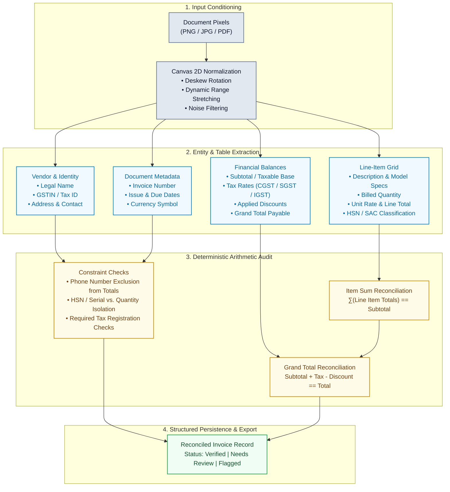
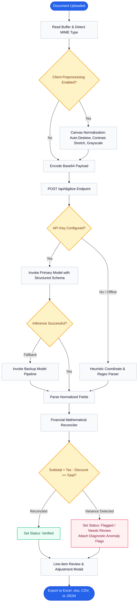
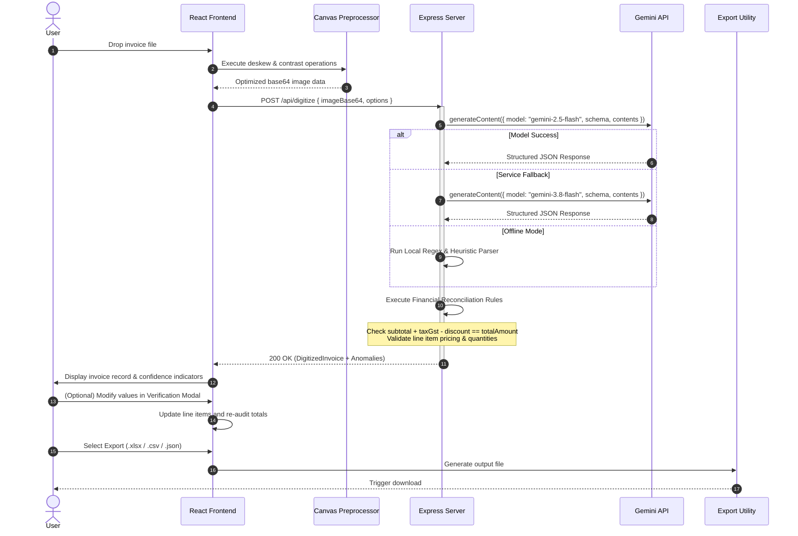
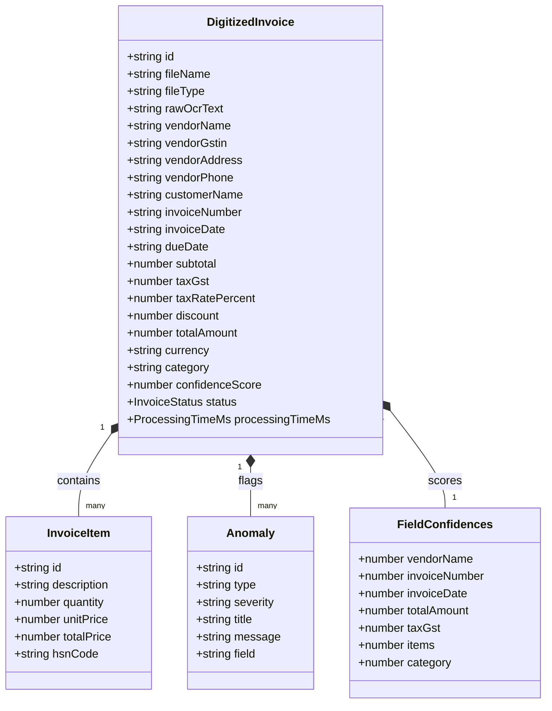
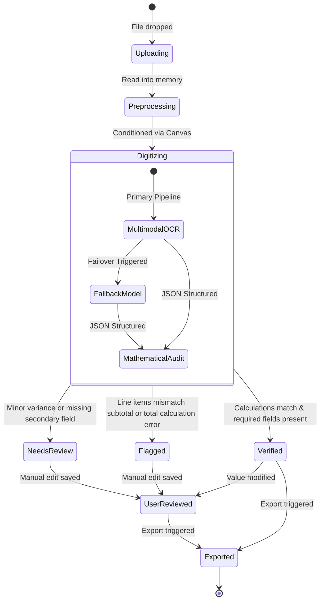

# Automated Document Digitizer

<div align="center">


<p align="center">
  Full-stack invoice OCR, tabular data extraction, and financial reconciliation engine.
</p>

</div>

---

## Table of Contents

- [System Architecture](#system-architecture)
- [Extraction & Validation Pipeline](#extraction--validation-pipeline)
- [End-to-End Processing Workflow](#end-to-end-processing-workflow)
- [Execution Sequence Diagram](#execution-sequence-diagram)
- [Data Entity & Schema Model](#data-entity--schema-model)
- [Document Status Lifecycle](#document-status-lifecycle)
- [Core Functional Modules](#core-functional-modules)
- [Tech Stack](#tech-stack)
- [Project Directory Structure](#project-directory-structure)
- [Getting Started](#getting-started)
- [API Reference](#api-reference)
- [License](#license)

---

## System Architecture

The application combines browser-side canvas pre-processing with a server-side extraction and reconciliation pipeline:

```
┌────────────────────────────────────────────────────────────────────────────────────────┐
│                                   CLIENT LAYER (React 19)                              │
│                                                                                        │
│  ┌───────────────────────┐   ┌────────────────────────┐   ┌─────────────────────────┐  │
│  │   Drag & Drop Zone    │──▶│  Canvas Preprocessor   │──▶│   Invoice Review Modal  │  │
│  │ (PDF / PNG / JPEG / …)│   │(Deskew/Contrast/Denoise│   │ (Edit Items & Amounts)  │  │
│  └───────────────────────┘   └────────────────────────┘   └────────────┬────────────┘  │
│                                           │                            │               │
└───────────────────────────────────────────┼────────────────────────────┼───────────────┘
                                            │ Base64 Payload             │
                                            ▼                            ▼
┌───────────────────────────────────────────────────────────┐ ┌──────────────────────────┐
│                   EXPRESS API BACKEND                     │ │      EXPORT ENGINE     │
│                                                           │ │                          │
│  ┌─────────────────────┐       ┌────────────────────────┐ │ │  ┌───────┐ ┌──────┐ ┌───┐│
│  │  POST /api/digitize │──────▶│ Mathematical Reconciler│─┼─┼─▶│ Excel │ │ CSV  │ │JSON│
│  └──────────┬──────────┘       │ (Totals / GST / Items) │ │ │  └───────┘ └──────┘ └───┘│
│             │                  └──────────▲─────────────┘ │ └──────────────────────────┘
└─────────────┼─────────────────────────────┼───────────────┘
              │                             │
              ▼                             │ Structured Response
┌───────────────────────────────────────────┼────────────────────────────────────────────┐
│                    MULTIMODAL INFERENCE ENGINE                                         │
│                                                                                        │
│   ┌────────────────────────────────┐            ┌──────────────────────────────────┐   │
│   │     gemini-2.5-flash           │──Fallback─▶│         gemini-3.8-flash         │   │
│   │ (Primary Low-Latency Pipeline) │  (On Load) │      (Cascading Redundancy)      │   │
│   └────────────────────────────────┘            └──────────────────────────────────┘   │
└────────────────────────────────────────────────────────────────────────────────────────┘
```

---

## Extraction & Validation Pipeline

The engine segments input documents into dedicated semantic extraction domains and subjects them to deterministic arithmetic audits:



---

## End-to-End Processing Workflow

The processing flow from document upload through verification:



---

## Execution Sequence Diagram

Sequence of interactions across client, server, and inference endpoints:



---

## Data Entity & Schema Model

Core TypeScript domain structure:



---

## Document Status Lifecycle



---

## Core Functional Modules

### 1. Document Signal Conditioning
- HTML5 Canvas 2D image transformation:
  - **Auto-Deskew**: Angle detection and orientation realignment.
  - **Dynamic Range Optimization**: Contrast stretching for faded or thermal receipts.
  - **Noise Reduction**: Grayscale filtering to sharpen tabular borders and character glyphs.

### 2. Information Extraction
- Structured multimodal parsing:
  - **Header & Vendor Metadata**: Vendor legal name, tax registration number (GSTIN / Tax ID), address, invoice identifier, and billing dates.
  - **Field Disambiguation**: Prevents 10-digit telephone numbers, 6-digit postal PIN codes, bank account numbers, or date stamps from being mistaken for financial totals.
  - **Tabular Line Items**: Captures item description, unit price, billed quantity, line-item total, and HSN/SAC code without stripping model numbers or technical specifications.

### 3. Financial Audit & Mathematical Reconciliation
- Automated arithmetic verification:
  - Validates that $\sum (\text{Quantity} \times \text{Unit Price}) = \text{Subtotal}$.
  - Validates that $\text{Subtotal} + \text{Tax} - \text{Discount} = \text{Grand Total}$.
  - Flags rounding variances and missing tax registrations.

### 4. Review & Export
- Interactive verification modal for reviewing and updating extracted line items.
- Multi-format file export:
  - **Excel (.xlsx)** via SheetJS with structured headers and item tables.
  - **CSV** for spreadsheet import.
  - **JSON** for programmatic downstream integration.

---

## Tech Stack

- **Frontend**: React 19, TypeScript, Vite, Tailwind CSS v4, Motion, Lucide Icons
- **Backend**: Node.js, Express, tsx, esbuild
- **AI & Processing**: `@google/genai` (Gemini API), Tesseract.js, HTML5 Canvas API
- **Data Export**: `xlsx` (SheetJS)

---

## Project Directory Structure

```text
├── Dockerfile                  # Multi-stage container build definition
├── docker-compose.yml          # Container orchestration specification
├── .dockerignore               # Container build exclusions
├── requirements.txt            # Python requirements (google-genai, requests, pillow, pydantic)
├── digitizer.py                # Standalone Python CLI & processing client
├── run.sh                      # Universal multi-mode run script
├── Makefile                    # Target shortcuts for developer workflows
├── index.html                  # HTML entry point
├── metadata.json               # Application metadata & permissions
├── package.json                # Dependencies and npm scripts
├── server.ts                   # Express backend API & Vite middleware
├── src/
│   ├── App.tsx                 # Main application UI and state management
│   ├── main.tsx                # React root mount
│   ├── types.ts                # TypeScript interfaces and entity types
│   ├── components/
│   │   ├── UploadDropzone.tsx  # Document upload area with image preprocessing
│   │   ├── EditInvoiceModal.tsx# Line item and financial verification modal
│   │   ├── InvoiceDetailViewer.tsx # Detailed invoice viewer & bounding overlay
│   │   ├── InvoiceDatabaseDashboard.tsx # Digitized invoice table & filter system
│   │   ├── ProcessingOverlay.tsx# Multi-stage extraction progress display
│   │   └── Header.tsx          # Header with actions and statistics
│   └── utils/
│       ├── exportUtils.ts      # CSV, JSON, and Excel export generators
│       ├── imagePreprocess.ts  # Canvas-based deskew, contrast, and denoising
│       └── numberFormat.ts     # Currency and numeric formatting helpers
└── vite.config.ts              # Vite configuration
```

---

## Universal Runnable Quickstart

The application is structured to run seamlessly across any environment—via Docker, Docker Compose, bare-metal Node.js, or local development.

### 1. One-Click Universal Script (`run.sh`)

An executable runner script is included to automatically configure your environment and launch the app in your desired mode:

```bash
# Make script executable (if needed)
chmod +x run.sh

# Start local live development (auto-creates .env and installs deps)
./run.sh dev

# Or build and launch with Docker in one step:
./run.sh docker

# Or run with Docker Compose:
./run.sh compose

# Or compile and launch in production mode:
./run.sh start
```

Available options:
- `./run.sh dev` - Starts development server with live reload at `http://localhost:3000`
- `./run.sh build` - Compiles frontend into `dist/` and bundles server into `dist/server.cjs`
- `./run.sh start` - Runs the production-optimized bundled server
- `./run.sh docker` - Builds Docker image and starts the container
- `./run.sh compose` - Orchestrates the application with Docker Compose
- `./run.sh lint` - Validates TypeScript types with zero compilation errors
- `./run.sh clean` - Purges build outputs and caches

---

### 2. Docker & Docker Compose (Containerized Execution)

#### Using Docker Compose (Recommended):
```bash
# 1. Provide your Gemini API key in .env
cp .env.example .env
# Edit .env and paste your GEMINI_API_KEY

# 2. Build and launch the container
docker compose up --build
```
Access the application at **`http://localhost:3000`**.

#### Using Standalone Docker:
```bash
# Build the production multi-stage image
docker build -t document-digitizer:latest .

# Run the container (with optional API key)
docker run -d \
  --name document-digitizer \
  -p 3000:3000 \
  -e GEMINI_API_KEY="your-gemini-api-key" \
  --restart unless-stopped \
  document-digitizer:latest
```

Health check verification:
```bash
curl http://localhost:3000/api/health
# {"status":"ok","hasGeminiKey":true}
```

---

### 3. Makefile Shortcuts

For developers using `make`:
```bash
make install       # Install dependencies
make dev           # Start Vite/Express development server
make build         # Compile production bundle
make start         # Launch compiled production bundle
make docker-build  # Build Docker container
make docker-run    # Run Docker container
make compose-up    # Launch with Docker Compose
make compose-down  # Stop Docker Compose
make lint          # Run TypeScript checks
```

---

### 4. Bare-Metal / Local Node.js Execution

#### Prerequisites:
- **Node.js** (v18, v20, or v22)
- **npm** (v9+)
- A **Gemini API Key** (optional: app automatically falls back to offline OCR + NLP if not provided)

#### Steps:
```bash
# 1. Install dependencies
npm install

# 2. Configure environment variables
cp .env.example .env
# Edit .env and set GEMINI_API_KEY

# 3. Launch Development Server
npm run dev

# Or build and launch Production Server:
npm run build
npm start
```
The application runs on `http://localhost:3000`.

---

### 5. Python CLI & Automation (`digitizer.py` & `requirements.txt`)

For batch processing pipelines, terminal workflows, and Python applications:

#### Installation:
```bash
pip install -r requirements.txt
# Or using the runner script:
./run.sh py-install
```

#### Dual-Engine Modes: Online & Offline
The Python digitizer operates seamlessly in both online cloud vision and 100% air-gapped offline environments:

```bash
# Auto mode (attempts Gemini 2.5 Flash if GEMINI_API_KEY is present; automatically falls back to local offline OCR)
python digitizer.py path/to/invoice.jpg

# Force 100% OFFLINE mode (zero external network or cloud calls; uses local Tesseract OCR & Rule-Based NLP)
python digitizer.py path/to/invoice.jpg --mode offline

# Force ONLINE mode (requires GEMINI_API_KEY in .env)
python digitizer.py path/to/invoice.pdf --mode online

# Export structured JSON data:
python digitizer.py path/to/invoice.pdf --output invoice_data.json

# Export line items table directly to CSV:
python digitizer.py path/to/invoice.png --csv items.csv

# Process via running web server daemon:
python digitizer.py path/to/receipt.jpg --server http://localhost:3000

# Using the runner script shortcut:
./run.sh py path/to/invoice.jpg --mode offline --output result.json
```

---

## Online vs. Offline Processing Capabilities

| Feature | Online Mode (Gemini 2.5/3.8 Flash) | Offline Mode (Local Tesseract & NLP) |
| :--- | :--- | :--- |
| **Network Requirement** | Internet access + API Key | **Zero external network access** (Air-gapped compatible) |
| **OCR Mechanism** | Multimodal Vision Foundation Models | Local Pre-bundled Tesseract (`eng.traineddata`) |
| **Negative Address Isolation** | Semantic Spatial Extraction | Regex & Heuristic Boundary Filters |
| **Mathematical Reconciler** | Multi-Pass Cross-Verification | Deterministic Balance Equations ($\sum \text{Items} = \text{Subtotal}$) |
| **Decimal Point Restoration** | Context-Aware Scale Alignment | Statistical Order-of-Magnitude Correction |
| **Processing Speed** | ~1.2s - 2.5s | ~0.6s - 1.8s |
| **File Format Support** | JPEG, PNG, WebP, PDF | JPEG, PNG, WebP, TIFF, PDF |

---

## API Reference

### `POST /api/digitize`
Uploads a base64-encoded invoice image or PDF for OCR extraction and financial analysis.

**Request Payload:**
```json
{
  "imageBase64": "data:image/png;base64,...",
  "mimeType": "image/png",
  "fileName": "invoice_102.png",
  "options": {
    "autoDeskew": true,
    "enhanceContrast": true,
    "denoise": true
  }
}
```

**Response:**
Returns a structured `DigitizedInvoice` object containing extracted metadata, reconciled financials, line items, and anomaly flags.

### `GET /api/health`
Health check endpoint reporting API availability and key configuration status.

---

## License

This project is licensed under the MIT License.
