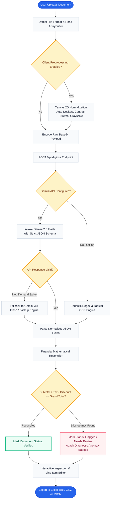
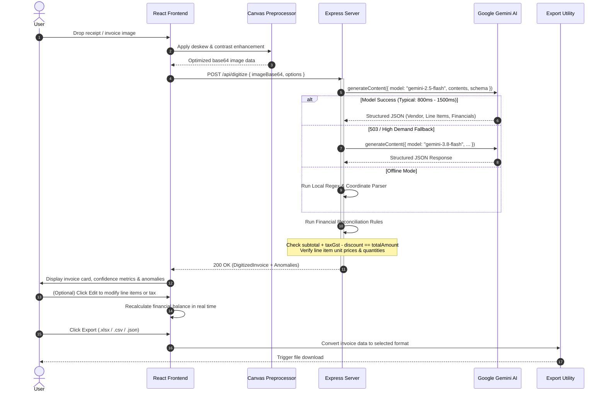
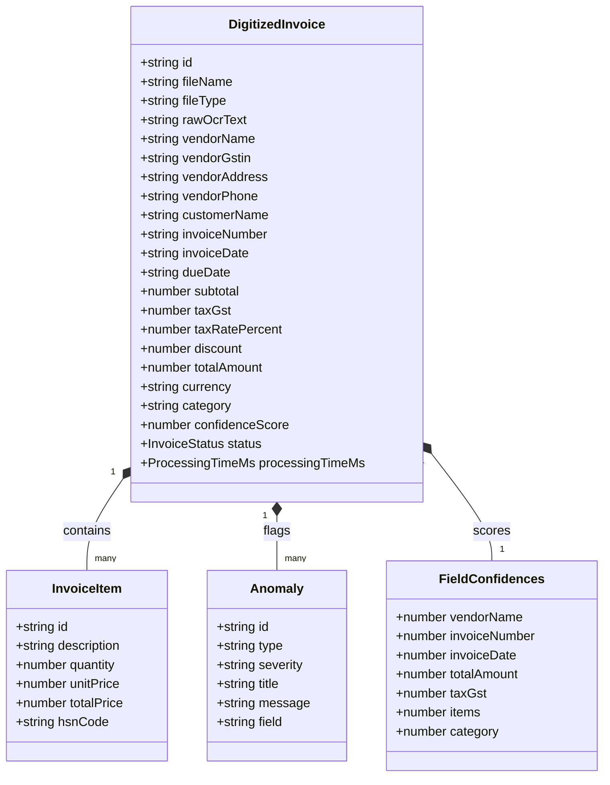
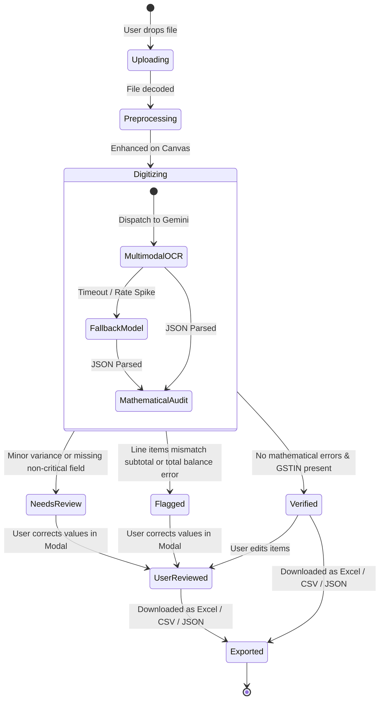

# Automated Document Digitizer

<div align="center">


<p align="center">
  <b>High-Precision Multimodal OCR, Itemized Table Extraction, and Automated Financial Reconciliation</b>
</p>

</div>

---

## Table of Contents

- [System Architecture](#system-architecture)
- [End-to-End Processing Workflow](#end-to-end-processing-workflow)
- [Execution Sequence Diagram](#execution-sequence-diagram)
- [Data Entity & Schema Model](#data-entity--schema-model)
- [Document Status Lifecycle](#document-status-lifecycle)
- [Feature Matrix](#feature-matrix)
- [Key Features](#key-features)
- [Tech Stack](#tech-stack)
- [Project Directory Structure](#project-directory-structure)
- [Getting Started](#getting-started)
- [API Reference](#api-reference)
- [License](#license)

---

## System Architecture

The Document Digitizer combines browser-side image signal conditioning with a server-side AI reasoning engine:

```
┌────────────────────────────────────────────────────────────────────────────────────────┐
│                                   CLIENT LAYER (React 19)                              │
│                                                                                        │
│  ┌───────────────────────┐   ┌────────────────────────┐   ┌─────────────────────────┐  │
│  │   Drag & Drop Zone    │──▶│  Canvas Preprocessor   │──▶│   Invoice Review Modal  │  │
│  │ (PDF / PNG / JPEG / …)│   │(Deskew/Contrast/Denoise│   │ (Edit Items & Amounts)  │  │
│  └───────────────────────┘   └────────────────────────┘   └────────────┬────────────┘  │
│                                           │                            │               │
└───────────────────────────────────────────┼────────────────────────────┼───────────────┘
                                            │ Base64 Payload             │
                                            ▼                            ▼
┌───────────────────────────────────────────────────────────┐ ┌──────────────────────────┐
│                   EXPRESS API BACKEND                     │ │      EXPORT ENGINE     │
│                                                           │ │                          │
│  ┌─────────────────────┐       ┌────────────────────────┐ │ │  ┌───────┐ ┌──────┐ ┌───┐│
│  │  POST /api/digitize │──────▶│ Mathematical Reconciler│─┼─┼─▶│ Excel │ │ CSV  │ │JSON│
│  └──────────┬──────────┘       │ (Totals / GST / Items) │ │ │  └───────┘ └──────┘ └───┘│
│             │                  └──────────▲─────────────┘ │ └──────────────────────────┘
└─────────────┼─────────────────────────────┼───────────────┘
              │                             │
              ▼                             │ Structured Response
┌───────────────────────────────────────────┼────────────────────────────────────────────┐
│                    GEMINI MULTIMODAL INFERENCE ENGINE                                  │
│                                                                                        │
│   ┌────────────────────────────────┐            ┌──────────────────────────────────┐   │
│   │     gemini-2.5-flash           │──Fallback─▶│         gemini-3.8-flash         │   │
│   │ (Primary Low-Latency Pipeline) │  (On Load) │      (Cascading Redundancy)      │   │
│   └────────────────────────────────┘            └──────────────────────────────────┘   │
└────────────────────────────────────────────────────────────────────────────────────────┘
```

---

## End-to-End Processing Workflow

This flowchart illustrates each stage a document traverses from raw file capture to verified export:



---

## Execution Sequence Diagram

The interaction sequence between client, server middleware, AI APIs, and local fallback:



---

## Data Entity & Schema Model

The core domain model representation:



---

## Document Status Lifecycle



---

## Feature Matrix

| Capability | Document Digitizer | Legacy Regex OCR | Standard Vision API |
| :--- | :---: | :---: | :---: |
| **Multimodal Context Understanding** | ✅ **Yes** (Gemini 2.5 Flash) | ❌ No | ⚠️ Partial |
| **Disambiguation (Phone vs. Totals)** | ✅ **Yes** (Zero-confusion rules) | ❌ High error rate | ⚠️ Requires manual post-filter |
| **Preserves Product Specs in Titles** | ✅ **Yes** (RAM, size, specs intact) | ❌ Truncates text | ⚠️ Often splits onto new rows |
| **Mathematical Self-Reconciliation** | ✅ **Yes** (Real-time discrepancy check) | ❌ No | ❌ No |
| **HSN / SAC Code Extraction** | ✅ **Yes** | ❌ Hard to isolate | ⚠️ Inconsistent |
| **Client-side Image Deskewing** | ✅ **Yes** (HTML5 Canvas 2D) | ❌ Server-dependent | ❌ External dependency |
| **Zero-Configuration Excel Export** | ✅ **Yes** (Multi-sheet SheetJS) | ⚠️ Plain CSV only | ❌ Extra tooling required |
| **Offline Fallback Architecture** | ✅ **Yes** (Resilient dual-pipeline) | ⚠️ Fragile | ❌ Hard failure without API |

---

## Key Features

- **Multimodal AI OCR & NLP Extraction**:
  - Leverages Google Gemini models (`gemini-2.5-flash` with fallback to `gemini-3.8-flash`) for rapid, high-accuracy field and table parsing.
  - Extracts key metadata: Vendor Name, GSTIN / Tax ID, Invoice Number, Billing Date, Due Date, and Contact Information.
- **Itemized Table Extraction**:
  - Captures complete line items including item description, specifications, quantity, unit rate, total price, and HSN/SAC codes.
- **Automated Financial Reconciliation & Anomaly Detection**:
  - Validates arithmetic consistency across subtotal, GST/tax rates, discounts, line-item sums, and grand totals.
  - Automatically flags discrepancies such as arithmetic mismatches, missing GSTINs, or calculation rounding differences.
- **Adaptive Image Preprocessing**:
  - Client-side canvas preprocessing: auto-deskewing, contrast enhancement, grayscale normalization, and denoising.
- **Human-in-the-Loop Verification & Editing**:
  - In-place modal to review extracted values, modify line items, and trigger automatic financial recalculation.
- **Export Capabilities**:
  - Export digitized invoices to **CSV**, **JSON**, or formatted **Excel (.xlsx)** spreadsheets.
- **Dark & Light Mode**:
  - Accessible theme toggle with WCAG-compliant color palettes and local preference persistence.
- **Offline Fallback Parser**:
  - Robust regex and positional heuristic extraction engine for offline scenarios or local fallback processing.

---

## Tech Stack

- **Frontend**: React 19, TypeScript, Vite, Tailwind CSS v4, Motion, Lucide Icons
- **Backend**: Node.js, Express, tsx, esbuild
- **AI & Processing**: `@google/genai` (Gemini API), Tesseract.js, Canvas 2D API
- **Data Export**: `xlsx` (SheetJS)

---

## Project Directory Structure

```text
├── index.html                  # HTML entry point
├── metadata.json               # Platform metadata & permissions
├── package.json                # Project dependencies and npm scripts
├── server.ts                   # Express backend API & Vite development middleware
├── src/
│   ├── App.tsx                 # Main application UI and state management
│   ├── main.tsx                # React root mount
│   ├── types.ts                # TypeScript interfaces and entity types
│   ├── components/
│   │   ├── DropZone.tsx        # Drag-and-drop document upload area
│   │   ├── EditInvoiceModal.tsx# Line item and financial verification modal
│   │   ├── InvoiceDetail.tsx   # Detailed invoice viewer & bounding-box overlay
│   │   ├── InvoiceTable.tsx    # Digitized invoices list and status badges
│   │   └── ProcessingOverlay.tsx# Multi-stage extraction progress display
│   └── utils/
│       ├── exportUtils.ts      # CSV, JSON, and Excel export generators
│       └── imagePreprocess.ts  # Canvas-based deskew, contrast, and denoising
└── vite.config.ts              # Vite configuration
```

---

## Getting Started

### Prerequisites

- **Node.js** (v18 or higher recommended)
- **npm** or **pnpm**
- **Gemini API Key** (available from [Google AI Studio](https://aistudio.google.com/))

### Installation

1. Clone the repository:
   ```bash
   git clone https://github.com/your-username/automated-document-digitizer.git
   cd automated-document-digitizer
   ```

2. Install dependencies:
   ```bash
   npm install
   ```

3. Configure environment variables:
   Copy `.env.example` to `.env`:
   ```bash
   cp .env.example .env
   ```
   Add your Gemini API key:
   ```env
   GEMINI_API_KEY="your-gemini-api-key-here"
   ```

---

## Running the Application

### Development Mode

Start the full-stack development server:
```bash
npm run dev
```
The application will be accessible at `http://localhost:3000`.

### Production Build

1. Build the frontend and server bundle:
   ```bash
   npm run build
   ```
2. Start the production server:
   ```bash
   npm run start
   ```

---

## API Endpoints

### `POST /api/digitize`
Uploads a base64-encoded invoice image or PDF for OCR extraction and financial analysis.

**Request Payload:**
```json
{
  "imageBase64": "data:image/png;base64,...",
  "mimeType": "image/png",
  "fileName": "invoice_102.png",
  "options": {
    "autoDeskew": true,
    "enhanceContrast": true,
    "denoise": true
  }
}
```

**Response:**
Returns the structured `DigitizedInvoice` object containing extracted metadata, reconciled financials, line items, and anomaly flags.

### `GET /api/health`
Health check endpoint reporting API availability and Gemini key status.

---

## License

This project is licensed under the MIT License.
